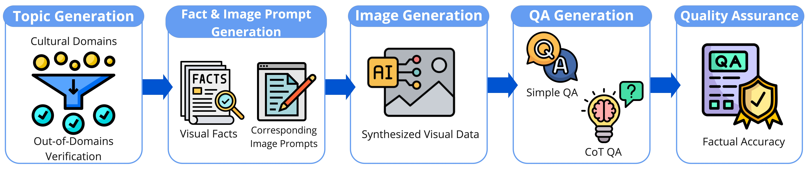
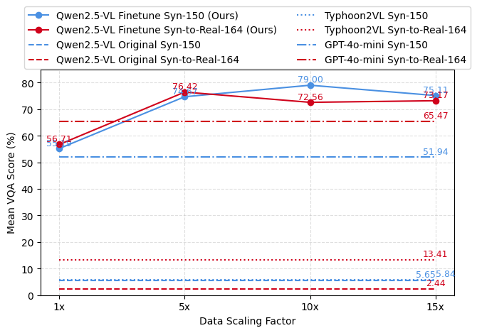
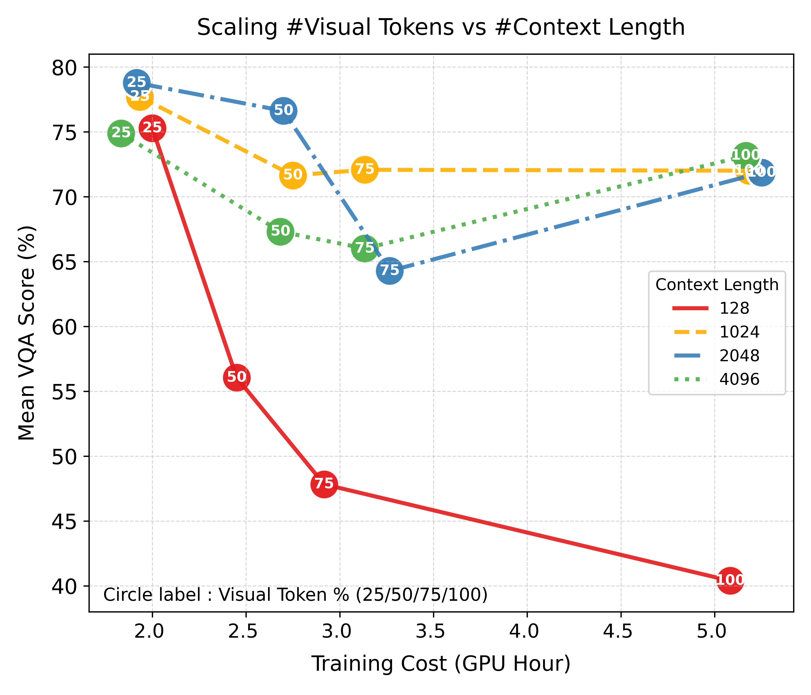

# Injecting New Knowledge Into Small Vision-Language Models Using Synthetic Corpus

Official repository for the paper:  
**“Injecting New Knowledge Into Small Vision-Language Models Using Synthetic Corpus”**  
*Thitirat Siriborvornratanakul, Songpol Bunyang* (2025)

---

## 🌏 Overview

Compact **Vision-Language Models (VLMs)** such as Qwen2.5-VL-3B often lack domain-specific knowledge, especially in **low-resource cultural contexts** like  Thai cultural contexts.  
This study presents a scalable method to inject domain-specific knowledge into compact VLMs using both **simple** and **Chain-of-Thought (CoT)** synthetic VQA pairs, specifically for Thai cultural contexts.

- 🚀 **Efficient knowledge injection** with minimal data (e.g., Syn-150 benchmark: 79% accuracy with 10x augmentation: 100 VQA pairs per new fact).  
- 🌉 **Strong sim-to-real generalization**, achieving >88% accuracy in real-world cultural benchmarks (Syn-to-Real-164).  
- 🧠 **Reasoning boost with CoT data**, outperforming GPT-4o-mini in reasoning benchmarks.  
- 💡 **Efficiency gains**: 95% higher performance with 60% less compute via visual token reduction + extended context length.  

---

## 🔑 Key Contributions

- Introduced a **scalable synthetic data pipeline** (topic → fact → prompt → image → QA → quality assurance).  
- Released two new **evaluation benchmarks**:  
  - **Syn-150** (synthetic VQA, 150 instances)  
  - **Syn-to-Real-164** (real-world Thai cultural imagery)  
- Demonstrated that **compact VLMs can efficiently acquire new, out-of-domain knowledge** with minimal synthetic supervision.  
- Highlighted the impact of **data scaling, visual token ratio, and context length** on efficiency.  

---

## 📊 Method

<p align="center">
  
</p>

**Fig. 1: Synthetic Data Pipeline**  
Five stages:  
1. Topic Generation & Verification  
2. Atomic Fact + Image Prompt Generation  
3. Image Synthesis (Imagen-3)  
4. QA Generation (simple + CoT)  
5. Quality Assurance (human + embedding similarity checks)  

---

## 🖼️ Results

<p align="center">
  
</p>

**Fig. 2: Impact of Data Scaling**  
- Performance peaks at **79% (Syn-150, 10x)** and **76% (Syn-to-Real-164, 5x)**.  
- Beyond these points, more synthetic data yields diminishing or negative returns.  

<p align="center">
  
</p>

**Fig. 4: Efficiency Trade-offs**  
- Best configuration: **25% visual tokens + 2048 context length** → 78% VQA at ~2 GPU hours.  
- Saves ~60% compute while improving accuracy vs baseline.  

---

## 📂 Synthetic VQA Data

[](https://huggingface.co/datasets/OHMEGA/VQA4Thai)
This repository provides **synthetic Thai VQA datasets** for knowledge injection into compact Vision-Language Models.  
The dataset includes both **Simple QA** and **Chain-of-Thought (CoT) QA**, with paired images, as well as evaluation sets.  

### Folder Layout
```yaml 
VQA4Thai/
├─ README.md # dataset card
├─ data/ # metadata (.jsonl)
│ ├─ CoT_5x.jsonl # 5x CoT reasoning VQA pairs
│ └─ simple_qa_10x.jsonl # 10x Simple VQA pairs
│ 
├─ eval/ # evaluation JSONL sets
│ ├─ 154_eval_qa.jsonl # Syn-150 synthetic eval set
│ └─ 164_eval_real_img_qa.jsonl # Syn-to-Real-164 real-image eval set
└─ images/ # paired image data
    ├─ simple qa/ # images for simple QA set
    │   ├─ 0001.jpg
    │   ├─ 0002.jpg
    │   └─ ...
    ├─ CoT/ # images for CoT QA set
    │   ├─ 0001.jpg
    │   └─ ...
    └─ eval/ # evaluation images
        ├─ syn150/ # images for synthetic eval
        │    ├─ 0001.jpg
        │   └─ ...
        └─ syn_to_real_164/ # real-world eval images
            ├─ 0001.jpg
            └─ ...

```


## 🚀 Quick Start with Google Colab

We provide two demo notebooks to replicate our experiments:

- **Fine-tuned Qwen2.5-VL-3B on synthetic data**  
  <a href="https://colab.research.google.com/github/YOUR-USERNAME/vlm-knowledge-injection/blob/main/notebooks/FT_SyntheticVQA_Demo.ipynb">
    
  </a>

- **Reasoning with CoT-augmented training**  
  <a href="https://colab.research.google.com/github/YOUR-USERNAME/vlm-knowledge-injection/blob/main/notebooks/CoT_VQA_Demo.ipynb">
    
  </a>

The notebooks include:
- Automatic environment setup  
- Checkpoint download (Hugging Face)  
- Running inference on Thai cultural VQA  
- Comparing FT vs CoT-trained models  

---

## 📥 Pretrained Checkpoints

[](https://huggingface.co/OHMEGA/VLM-KnowledgeInjection)

All checkpoints are available in one Hugging Face repo:  
👉 [OHMEGA/VLM-KnowledgeInjection](https://huggingface.co/OHMEGA/VLM-KnowledgeInjection)

| Model Variant        | Strategy                | Dataset Scale      | Filename |
|----------------------|-------------------------|-------------------|----------|
| FT-Qwen2.5-VL-3B     | Full Fine-Tuning (FT)   | Syn-150 (10x)     | `FT_Qwen2.5VL_Syn150_10x.pth` |
| FT-Qwen2.5-VL-3B-CoT | Full Fine-Tuning (FT)   | Syn-150 + CoT     | `FT_Qwen2.5VL_CoT_5x.pth` |
| PEFT-Qwen2.5-VL-3B   | QLoRA (4-bit, PEFT)     | Syn-150 (5x)      | `PEFT_Qwen2.5VL_Syn150_5x.pth` |

#### 📌 How to load in Python

```python
from huggingface_hub import hf_hub_download

# Example: load CoT model
ckpt_path = hf_hub_download(
    repo_id="OHMEGA/VLM-KnowledgeInjection",
    filename="FT_Qwen2.5VL_CoT_5x.pth"
)
```
